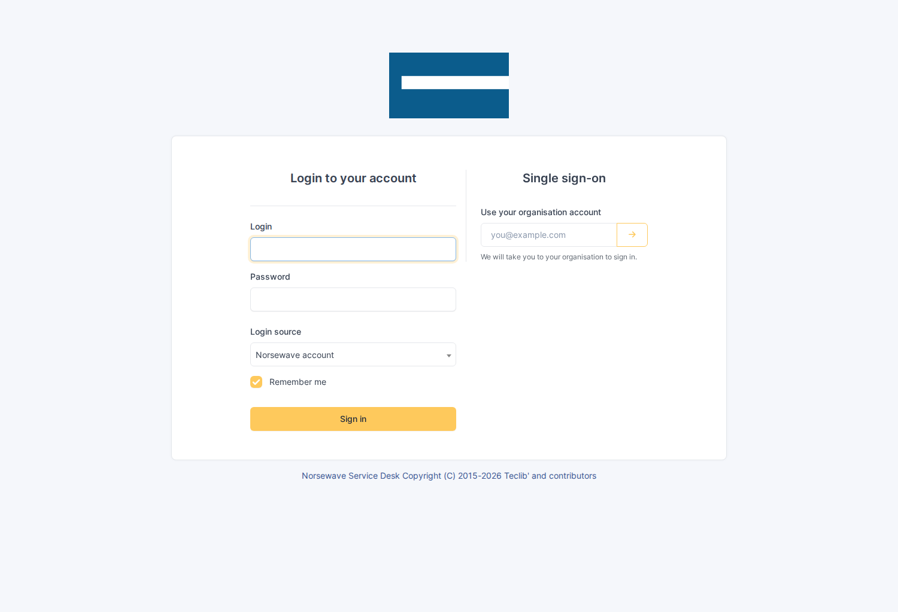
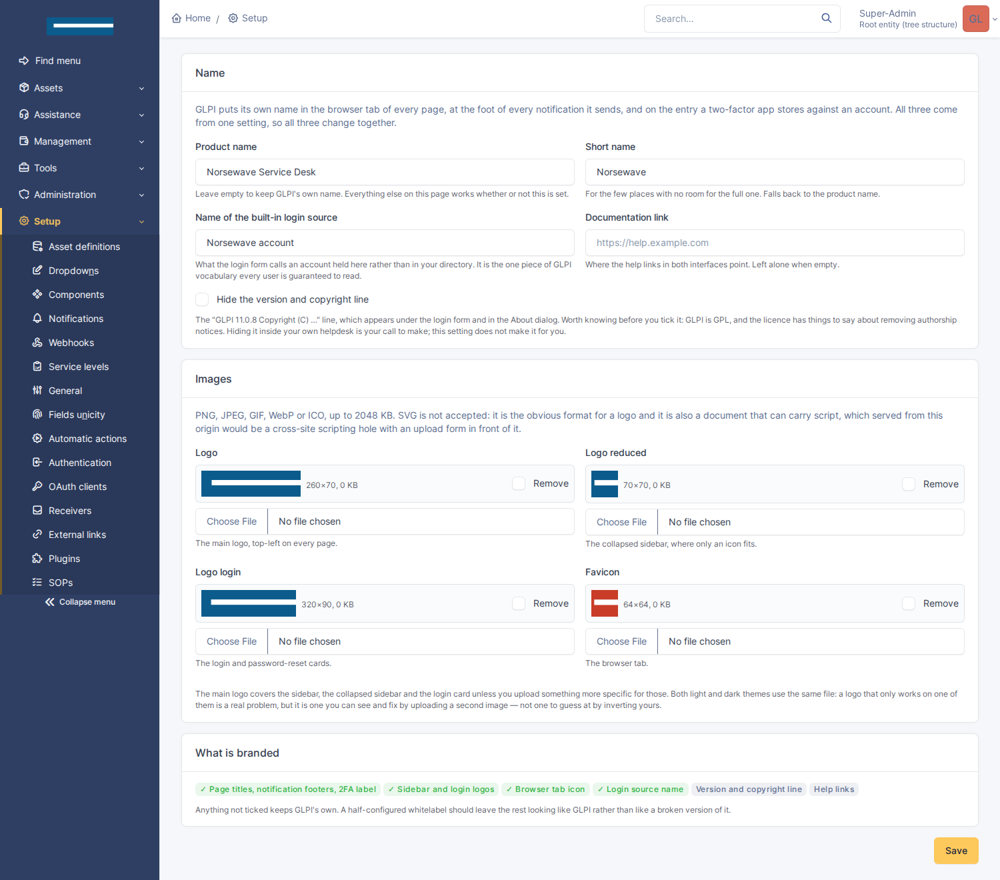

# Whitelabel

GLPI, wearing your name instead of its own.

An MSP hands this interface to its customers, and "GLPI" means nothing to them.
It is not a vanity exercise: a helpdesk that announces a product the user has
never heard of, in a browser tab that says GLPI, above a logo that is not yours,
reads as somebody else's system that you happen to be typing into.



Requires GLPI 11.0. No tables, no dependencies, and nothing to reapply after an
upgrade — everything here works through mechanisms GLPI already has.

---

## What it changes

- **The name**, in the browser tab of every page, at the foot of every
  notification GLPI sends, and on the entry a two-factor app stores against an
  account. All three come from one core setting.
- **The logos** — sidebar, collapsed sidebar, login card, About dialog — in both
  light and dark themes.
- **The browser tab icon.**
- **The name of the built-in login source**, which is the one piece of GLPI
  vocabulary every user is guaranteed to read.
- **The version and copyright line**, optionally.
- **The help links**, through core's own settings.

Everything not configured keeps GLPI's own. A half-configured whitelabel should
leave the rest looking like GLPI rather than like a broken version of it.

[docs/surfaces.md](https://gitlab.rfni.dev/norsewind/glpi-erpnext-mods/-/wikis/glpi-whitelabel/surfaces) is the full inventory: every place GLPI
states its identity, what covers it, and what deliberately does not.

## Install

```bash
# from the GLPI root — the directory has to be named for the plugin
# key, which is not the repository name
git clone https://github.com/bijstaan/glpi-whitelabel.git plugins/whitelabel
php bin/console plugin:install -u glpi whitelabel
php bin/console plugin:activate whitelabel
```

Then **Setup → Plugins → Whitelabel**.



Images go on disk under GLPI's plugin document directory — the place GLPI
already guarantees is writable, already keeps out of the web root, and already
backs up. The config table holds only the name and which images exist, so
reading the settings never means reading a megabyte of base64.

**SVG is not accepted.** It is the obvious format for a logo, and it is also a
document that can carry script — served from GLPI's own origin, that is stored
cross-site scripting with an upload form in front of it. PNG, JPEG, GIF, WebP
and ICO only, and the format is decided by reading the file's header rather than
trusting its name.

## How it works, and the two orderings that shaped it

The name is `$CFG_GLPI['app_name']`, set during plugin init. The logos are CSS
custom properties. Neither requires knowing which template renders what.

Two things are decided by load order, and both come down to the same fact: **a
plugin is loaded before core finishes speaking.**

The stylesheet is injected above core's CSS links, so a plugin rule on `:root`
loses to core's identical rule further down. It uses `:root:root` instead, which
wins on specificity without spending `!important` — worth keeping in reserve for
a site's own custom CSS.

The favicon is worse: core writes its `<link>` *after* anything a plugin can
inject, and browsers disagree about whether the first or last icon wins. Adding
one is not enough, so the browser half removes core's.

That browser half follows one rule strictly: **it never searches the page for
the word "GLPI".** Every replacement is anchored to a selector that identifies
core's chrome. The blanket approach eventually rewrites a ticket whose author
mentioned GLPI, a knowledge article about migrating off it, or a customer with
it in their company name.

## Hiding the copyright

The switch exists and is off by default. GLPI is GPL and the licence has things
to say about removing authorship notices; whether hiding it inside your own
helpdesk matters is a question for your situation. The setting is explicit so
the decision is yours rather than one the plugin makes quietly on your behalf.

## Tests

```bash
cd glpi-whitelabel/tests/browser && SHOT_DIR=../../docs/screenshots \
  node wl-check.js
```

There is no CLI suite, because there is nothing here a CLI could judge: every
claim this plugin makes is about what a *page* looks like. The check drives the
settings form the way an administrator would — uploads included — then reads the
login page, the technician interface and the portal back, and finally removes
the branding and confirms GLPI gets its own name and face back. It writes the
screenshots in this README on the way through.

It caught three things worth naming:

- The endpoints serving the stylesheet and the images were **auth-denied**,
  because GLPI 11 routes plugin scripts through its firewall and the default for
  a legacy script is "must be authenticated". The login page then requested a
  stylesheet, got an access-denied *page*, and — because that handling tears the
  session down — **every subsequent page reported that the session had expired**.
  Core marks its own `/front/css.php` public for the same reason;
  `Firewall::addPluginStrategyForLegacyScripts()` is how a plugin says it too.
- The settings form posted to `$_SERVER['PHP_SELF']`, which under GLPI 11's
  front controller is `/index.php` rather than the page. It saved nothing and
  looked like it had. **glpi-search had the same bug**, undetected, because its
  browser check only asserted that search still worked afterwards.
- Renaming the login source changed the `<option>` and **nothing the user sees**,
  because GLPI renders that select through select2, which builds its own element
  and stops looking at the options.

## Layout

```
setup.php              app_name, the asset hooks, and the firewall strategies
hook.php               install/uninstall: one right, no tables
src/Settings.php       what the brand is; the head tags that carry it
src/Assets.php         uploads: validated by header, stored outside the web root
src/Brand.php          the generated stylesheet
front/config.php       the settings page
front/style.php        the stylesheet, public by design
front/asset.php        one image, public by design
public/js/whitelabel.js  the favicon, and the text CSS cannot reach
docs/surfaces.md       every place GLPI says it is GLPI
```

## Licence

GNU General Public License, version 3 or later — the same licence as GLPI.
This plugin is loaded into GLPI's process and extends its classes, so it is a
derivative work of GLPI and carries GLPI's licence. See [LICENSE](LICENSE).
